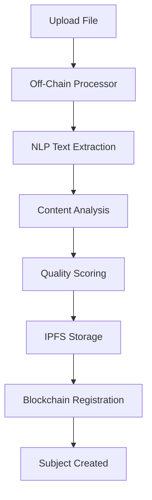

# AcademicToken Frontend - Off-Chain Processor Integration

## Overview

The AcademicToken frontend now includes full integration with the off-chain subject content processor, providing advanced AI-powered syllabus analysis and blockchain registration.

## 🚀 New Features

### Enhanced File Processing
- **Real File Upload**: Select PDF, TXT, DOCX, or RTF files from your computer
- **AI-Powered Extraction**: Advanced NLP analysis of syllabus content
- **Quality Scoring**: Automatic quality assessment and confidence metrics
- **IPFS Storage**: Distributed storage for complete syllabus data
- **Blockchain Registration**: Seamless integration with AcademicToken blockchain

### Advanced Analytics
- **Topic Extraction**: Automatically identifies course topics and keywords
- **Quality Metrics**: Provides extraction confidence and quality scores
- **Enhanced Metadata**: Rich metadata stored both on-chain and in IPFS
- **Prerequisites Detection**: Identifies course prerequisites and dependencies

## 🔧 Setup and Configuration

### 1. Off-Chain Processor Setup

The off-chain processor is located at:
```
/Users/biancamsp/Desktop/Academic_Token/academictoken/academictoken/tools/off_chain_processor/subject_content_processor.go
```

Make sure it's compiled and executable:
```bash
cd /Users/biancamsp/Desktop/Academic_Token/academictoken/academictoken/tools/off_chain_processor
go build -o subject_content_processor subject_content_processor.go
```

### 2. Frontend Configuration

The integration is configured in `app/services/offChainProcessor.ts` with the following default settings:

```typescript
const config = {
  processorPath: "/Users/biancamsp/Desktop/Academic_Token/academictoken/academictoken/tools/off_chain_processor/subject_content_processor",
  tempDir: "/tmp/academic_token_processing",
  enableIPFS: true,
  chainId: "academictoken",
  from: "admin",
  node: "tcp://localhost:26657",
  debug: true
}
```

## 💻 Usage

### For Real Files

1. **Click "Select Real File"** on the Institution Dashboard
2. **Choose a syllabus file** (PDF, TXT, DOCX, RTF)
3. **Click "Process & Submit to Blockchain"**
4. **Watch the AI processing** with real-time progress updates
5. **Review the results** with quality scores and extracted metadata

### Processing Flow



### Example Output

After processing, you'll see:
- **Quality Score**: 8.5/10
- **Confidence**: 92%
- **Topics Extracted**: 15 topics
- **Keywords**: 25 keywords
- **Bibliography**: 12 references
- **IPFS Hash**: QmYwAPJzv5CZsnA625s3Xf2nemtYgPpHdWEz79ojWnPbdG

## 🎯 Demo Mode vs Live Mode

### Demo Mode (Blockchain Not Connected)
- Full AI processing pipeline active
- Mock blockchain integration
- All analysis and extraction features work
- Results displayed with demo indicators

### Live Mode (Blockchain Connected)
- Real blockchain transactions
- IPFS storage integration
- Permanent academic records
- Cross-institutional compatibility

## 🔍 Monitoring and Debugging

### Processing Status
The interface shows real-time processing status:
- "Starting off-chain processing..."
- "Extracting content and analyzing syllabus..."
- "Creating subject with processed data..."

### Debug Information
Enable debug mode in the processor config to see detailed logs:
```typescript
debug: true
```

## 📊 Enhanced Subject Display

Processed subjects show additional metadata:
- **Quality Score Badge**: 🧠 8.5/10
- **Content Statistics**: 📚 15 topics • 🔑 25 keywords • 📖 12 refs
- **Storage Type**: 🌐 IPFS or ⛓️ On-chain

## 🛠️ API Integration

### Off-Chain Processor API

The processor accepts these parameters:
```bash
./subject_content_processor <file> <institution> <course_id> <subject_code> [options]

Options:
  --process-only     Only extract and analyze, don't submit to blockchain
  --create-only      Create subject and token definition only
  --tokenize-only    Only mint tokens (requires existing subject)
  --student <addr>   Student address for token minting
  --chain-id <id>    Blockchain chain ID
  --from <key>       Signing key name
  --node <url>       RPC node URL
  --no-ipfs         Disable IPFS storage
  --debug           Enable debug logging
```

### Processing Result Structure

```typescript
interface ProcessingResult {
  contentHash: string;
  ipfsCid?: string;
  subjectContent: SubjectContent;
  extractedData: ExtractedSyllabusData;
  prerequisites: PrerequisiteGroup[];
  processingMetrics: ProcessingMetrics;
}
```

## 🚨 Error Handling

### Common Issues

1. **Processor Not Found**
   - Check that the Go binary is compiled and executable
   - Verify the path in `ProcessorConfig`

2. **File Processing Fails**
   - Ensure file format is supported (PDF, TXT, DOCX, RTF)
   - Check file permissions and size limits

3. **IPFS Connection Issues**
   - IPFS daemon must be running on localhost:5001
   - Or disable IPFS with `enableIPFS: false`

### Graceful Fallbacks

The system includes graceful fallbacks:
- If off-chain processor fails, falls back to simple registration
- If IPFS fails, stores only on-chain metadata
- If blockchain fails, operates in demo mode

## 🔮 Future Enhancements

### Planned Features
- **Batch Processing**: Upload multiple syllabi at once
- **Template Recognition**: Identify different syllabus formats
- **Multi-language Support**: Process syllabi in different languages
- **Advanced Analytics**: Course similarity analysis and recommendations
- **Integration APIs**: REST APIs for external system integration

### Extensibility
The architecture supports easy addition of:
- New file format processors
- Custom extraction algorithms
- Additional quality metrics
- External validation services

## 📝 Configuration Examples

### Basic Configuration
```typescript
const processor = ProcessorFactory.getInstance({
  enableIPFS: true,
  debug: false
});
```

### Advanced Configuration
```typescript
const processor = ProcessorFactory.getInstance({
  processorPath: "/custom/path/to/processor",
  tempDir: "/custom/temp/directory",
  enableIPFS: true,
  chainId: "academictoken-testnet",
  from: "institution-admin",
  node: "tcp://testnet.academictoken.com:26657",
  debug: true
});
```

## 🎓 Educational Benefits

This integration provides:
- **Standardized Content Analysis**: Consistent quality metrics across institutions
- **Rich Academic Metadata**: Comprehensive course information for students
- **Interoperability**: Cross-institutional course equivalence analysis
- **Transparency**: Immutable academic records with verifiable quality scores
- **Efficiency**: Automated processing reduces administrative overhead

## 📞 Support

For issues or questions about the off-chain processor integration:
1. Check the console logs for detailed error messages
2. Verify all prerequisites (Go binary, IPFS, blockchain)
3. Test with demo files first before using real syllabi
4. Review the processor logs in debug mode for detailed analysis

The integration bridges the gap between advanced AI processing and blockchain permanence, creating a powerful platform for modern academic record management.
